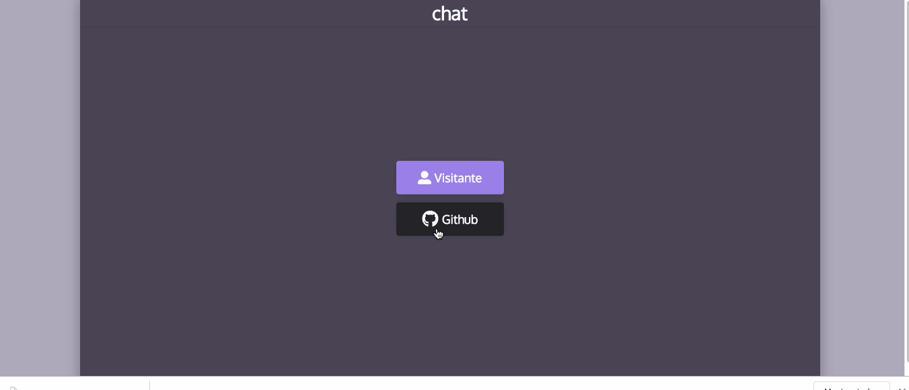

<h1 align="center">
  <h1>Chat-Concept</h1>
</h1>

#### :rocket: 1. Dependencias Utilizadas
<h2>Backend</h2>
Axios
Cors
DotEnv
Express
Mongoose
Socket.io

<h2>Frontend</h2>
Axios
Cors
DotEnv
Express
Mongoose
Socket.io

#### 4. Resultado final

---

Feito com ♥ by [Jonathan](https://www.linkedin.com/in/jonathan-barros-franco)
